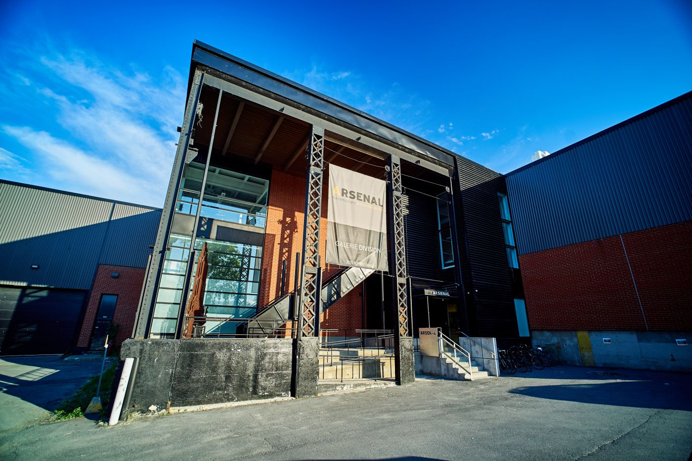

# FICHE DE PRÉSENTATION

## Nom de l'exposition
METAMORPHOSIS - 6e Biennale d'art numérique (BIAN)

### Lieu de mise de l'exposition
2020 Rue William, Montréal

### Type d'exposition
Exposition intérieure

### Date de visite
Jeudi le 2 février 2023

## Titre de l'oeuvre
Copacabana Machine Sex

### Nom de l'artiste
Bill Vorn

### Année de réalisation
2018

### Description de l'oeuvre

####  - Type d'installation: Contemplative

### Mise en espace

### Composantes et techniques

### Éléments nécessaires à la mise en exposition

### Expérience vécu

### ❤️ Ce qui m'a plu & ce qui m'a donné des idées 💡
J'ai aimé plein de choses lorsqu'on a vécu le définition de l'oeuvre à l'oeil nu. Comme la chorégraphie des robots ainsi que la thématique robotique. Je pourrais regarder ce genre de spectacle pendant des heures. Cela serait une source que je pourrais m'inspirer dans mes futurs projets de multimédias.

### 🤔 Aspects que je ne souhaite pas retenir pour mes propres créations ou que je fairais autrement
Je ne pense pas vraiment m'inspirer trop de ce genre d'art, c'est beaucoup trop de travail à reproduire. Trop de programation pour faire dancer des robots pendant 15 minutes, même si j'essaierai de faire dancer des robots, je n'aurais jamais la patience de compléter ce genre de travail, je ne pense pas atteindre une certaine perfection qui est à mes attentes. Ce que j'aimerais faire à la place, ça serait d'animer des robots en 3D.
## Référence(s)

- https://www.arsenalcontemporary.com

