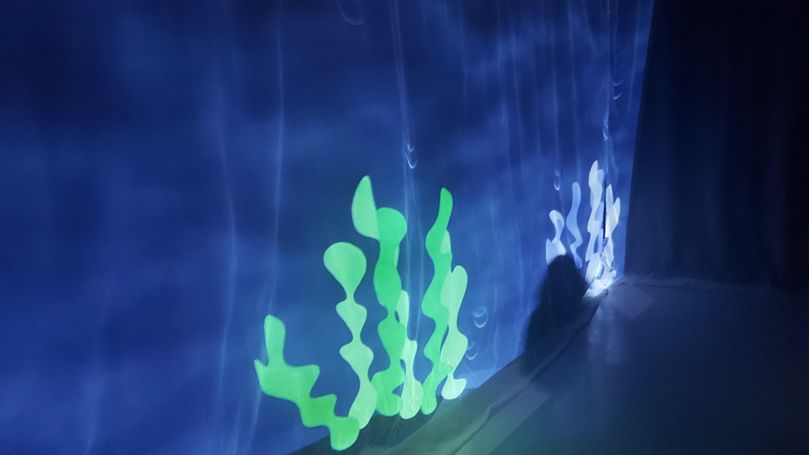
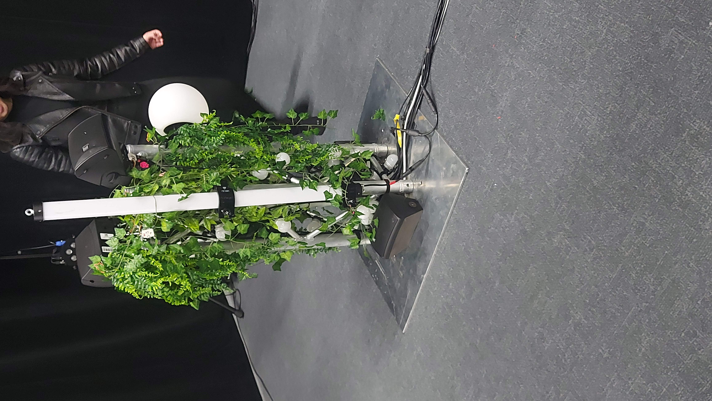
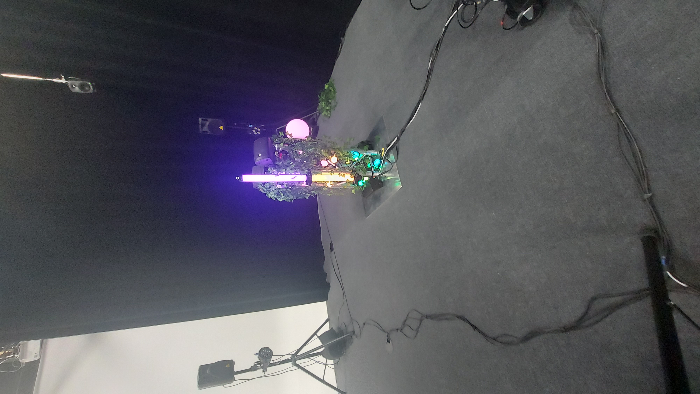
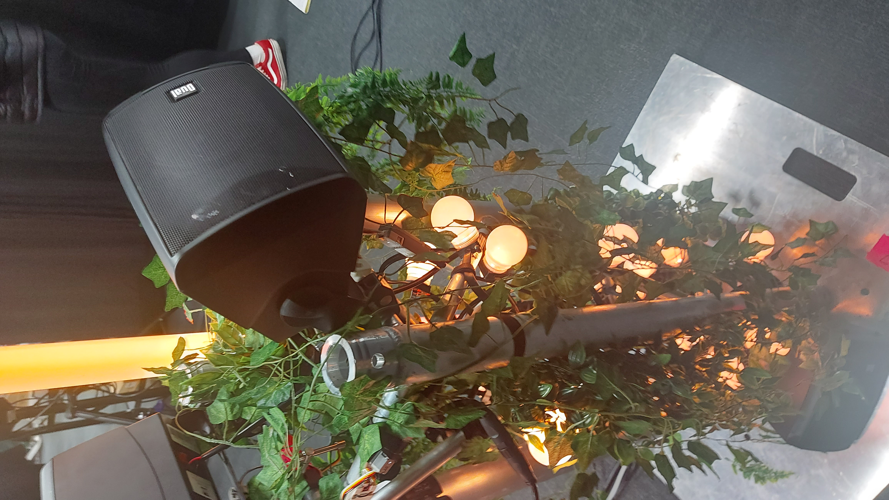
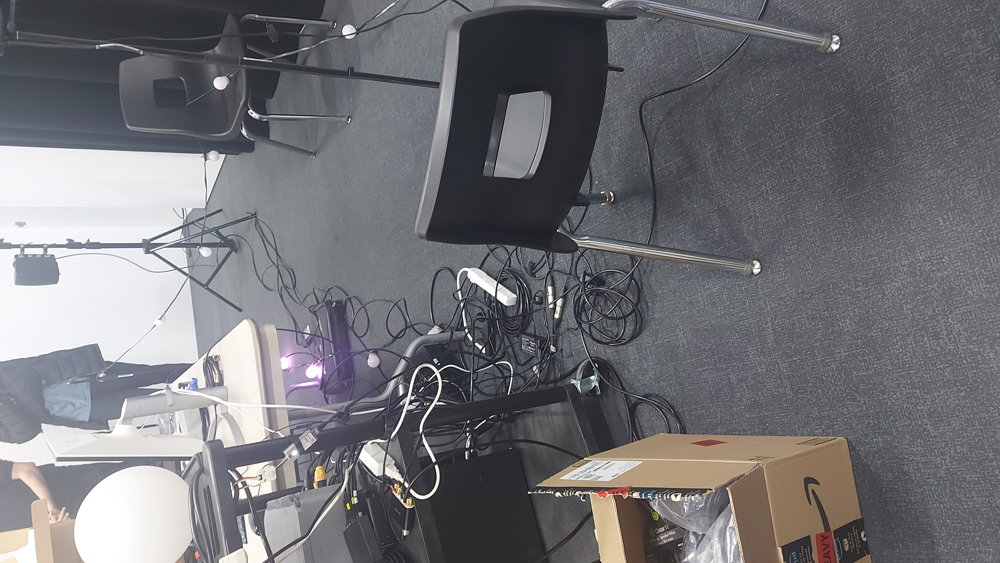
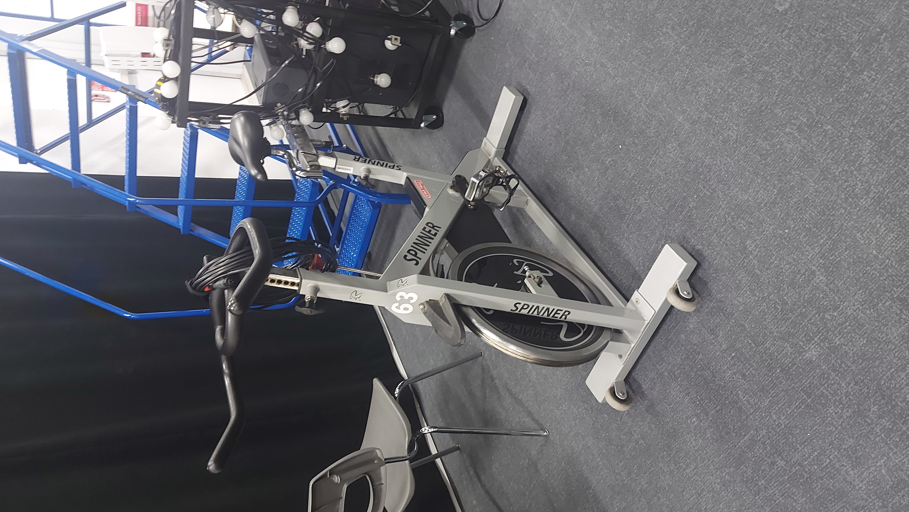
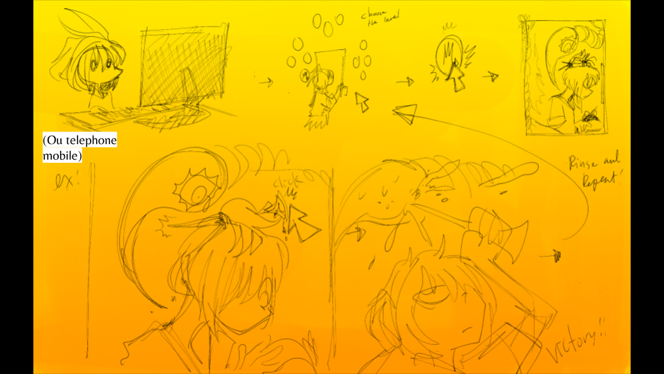
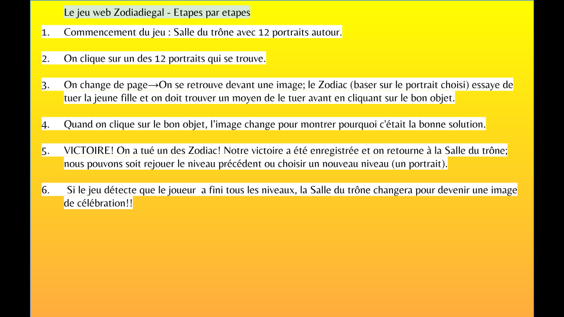

# Les projets des 3e années

## 1 - Echomarine

#### Réalisateurs:
<table>
  <tr>
    <td>
Maria Laura Coronel
    </td>
    <td>
Tracy Gua
       </td>
    <td>
Natacha Abdallah
      </td>
    <td>
Florence Lapierre
      </td>
  </tr>   
  </table>
  
  ##### Description:
Le projet Echomarine est une expérience immersive, une projection murale panoramique qui montre une animation avec des ambiances sonorisés qui faient penser qu'on serait sous l'océan, le thème ici étant les animaux sous-marins en voie d'extinction. 

Le but de ce projet est de faire réagir les spectateurs concernant les animaux marins.

#### Schéma :

 [^1].

---

## 2 - Edria
#### Réalisateurs:
<table>
  <tr>
    <td>
Elwin Durand
    </td>
    <td>
Loic Delorme
       </td>
    <td>
Dominic Robert
      </td>
    <td>
Meryem Berbiche
      </td>
    <td>
Gabriel Leblanc
      </td>
    <td>
Jean-Cristophe
  </td>
  </tr>
  </table>
  
  ##### Description: 
  Projet collectif qui consiste d'une installation intéractive, qui se passe à l'extérieur juste en face de l'entrée du collège
  
  
   
    
    
    
    
  
  - [Leur site web](https://tim-montmorency.com/2023/projets/ENTRE-FUNGUS/docs/web/index.html)

#### Schéma :
 [^2].

  
---

## 3 - Nexum / Boucler la boucle

#### Équipe du projet

<table>
  <tr>
    <td>
Sabrina Laforest
    </td>
    <td>
Sébastien Reilly
       </td>
    <td>
Maxime Des Lauriers
      </td>
    <td>
Alexandre Daniel
      </td>
  </tr>   
  </table>
  
  

#### Description: 
Nexum est une expérience lumineuse de type immersive et interactive, une ambiance harmonieuse et musicale lorsque l'on se promène entre le chemin de lumière.

#### Schéma :

 [^3]

---

## 4 - Luma Sol

#### Équipe du projet:
<table>
  <tr>
    <td>
Skayla Stimphil
    </td>
    <td>
Michael Simard
       </td>
    <td>
Pénélope Morrisson
      </td>
    <td>
Éloise Gagné
      </td>
  </tr>   
  </table>
  
   
  

##### Description:
Ce projet intéractif consite à pédaler sur un vélo stationnaire permettant de générer de l'énergie vers des lumières attachés dans un arbre. Le but du projet est de partager le message qu'il y a un mode de vie écologique et qu'il y a plein de techniques à mieux prendre soin de la nature.

#### Schéma :

 [^4].

---

## 5 - Zodie-Gal

#### Réalisateur: 
<table>
  <tr>
    <td>
      Yara Abdanor
    </td>
  </tr>
  </table>

##### Description:

#### Schéma :

 [^5].

---

## 3 cours du programmes incontournables pour réaliser les projets
- Objets interactifs
- Traitement audiovisuel, permettant de réaliser tout les effets audiovisuels.
- Installation Multimédia

# [Mon projet préféré](H23_V13_inspirations_proulx/Mycelium/Oeuvre_Favori.md)

---

##### Liste des références:
[^1]: Boucler la boucle https://tim-montmorency.com/2023/projets/Boucler-la-boucle/docs/web/preproduction.html
[^2]: Schéma EDRIA https://tim-montmorency.com/2023/projets/EDRIA/docs/web/preproduction.html#sch%C3%A9mas-ou-plans-techniques
[^3]: Schéma Echomarine https://tim-montmorency.com/2023/projets/Echomarine/docs/web/preproduction.html
[^4]: Schéma Luma-sol https://tim-montmorency.com/2023/projets/LumaSol/docs/web/preproduction.html
[^5]: Schéma Zodie-gal https://tim-montmorency.com/2023/projets/Zodie-Gal/docs/web/preproduction.html

