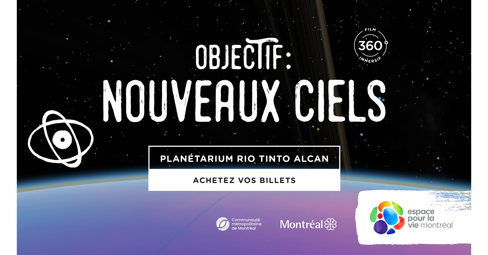
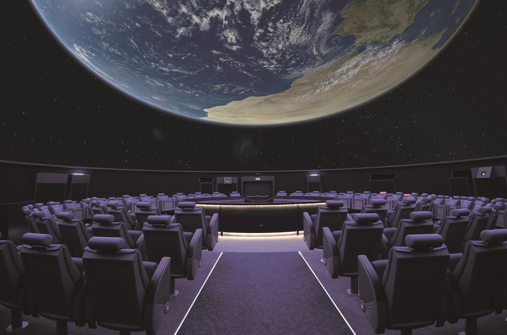
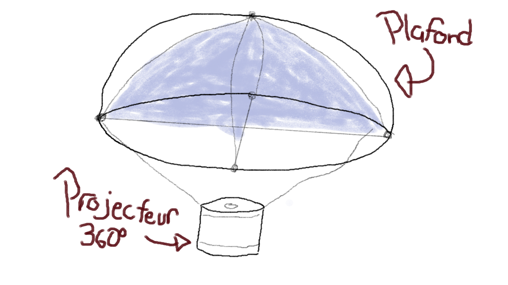

# Ma visite individuelle

## Titre du spectacle
Nouveaux Ciels

## Artiste/Réalisateur
Cette pièce a été réalisé par le studio __Félix & Paul__

## Année de réalisation
Nouveaux Ciels a été réalisé en 2021

### Lieu de l'exposition

L'exposition se trouve au Planétarium Rio Tinto Alcan à Montréal, est voisin du Stade Olympique et du Biodôme.

#### Informations du lieu

Le Planétarium Rio Tinto Alcan étant le successeur du Planétarium de Montréal.

### Ma date de visite

J'ai été visité le jeudi 2 mars 2023 [^note].

### Type d'exposition
C'était une exposition intérieure et immersive, c'était comme aller au cinéma.

---

## Présentation de l'œuvre

### Description
La production que j'ai été visité était une expérience plutôt éducative qui parle des planètes habitables en dehors de notre système solaire (exoplanètes). 

### Type d'installation
Le spectacle Nouveux Ciels est une œuvre interactive et immersive.

### Mise en espace
La salle où se déroule le spectacle est une pièce circulaire. Dans cette pièce on retrouve plusieurs rangés de sièges qui entourent un projecteur qui illumine le plafond, les sièges sont un peu inclinés vers l'arrière pour que l'individu regarde confortablement le plafond.

### Composantes
- Projecteur 360°, afin de projeter une image panoramique sur le plafond.
- Haut-parleurs, qui servent pour qu'on entende bien la musique, les effets sonores, ainsi que la voix de l'animatrice.

### Éléments nécessaire à la mise en exposition

## Fonction / Gestes
Une animatrice proposait un vote au monde dans la salle selon la planète que l'on désire visiter. Méthode de vote: Principalement faire le plus de bruit possible (crier, clapper des mains, taper les pieds sur le sol). Notre vote influencerait le déroulement du spectacle.

# Expérience vécue
Cette expérience immersive était vraiment spectaculaire, le fait de s'assoir regarder le vide de l'espace sur une projection au plafond m'a donné l'impression d'y être, exactement comme dans une réalité virtuelle.

# Liens avec autres œuvres
Echomarine, le projet des étudiants des 3e années.
#### Lien: Projection panoramique

[^note]: Visite faite avec mon père
