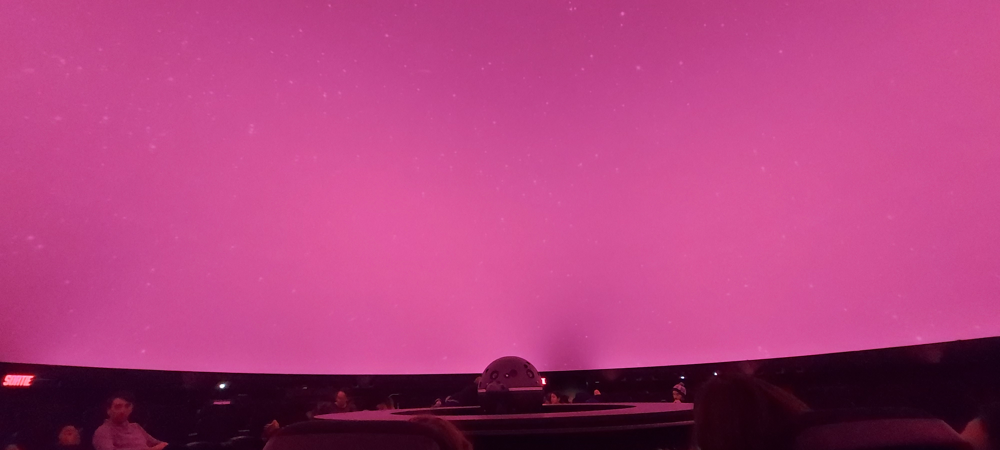
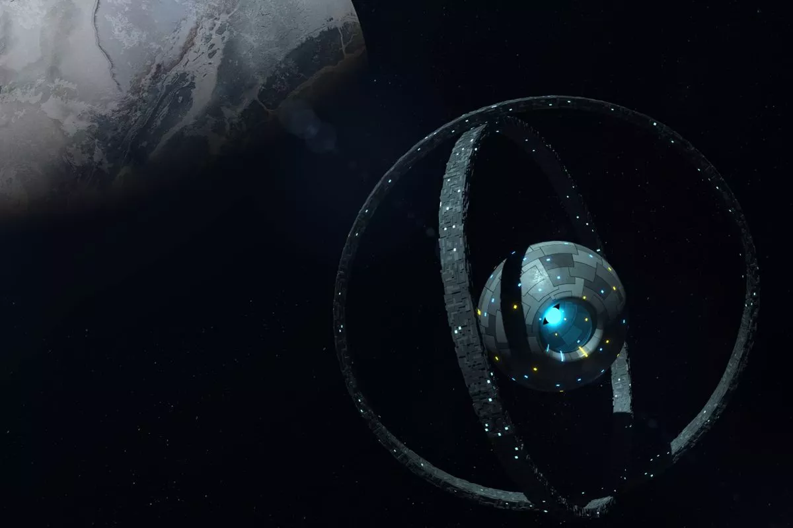

# Ma visite individuelle

## Titre du spectacle
Nouveaux Ciels

## Artiste/Réalisateur
Cette pièce a été réalisé par le studio __Félix & Paul__, en collaboration avec Time Studios

## Année de réalisation
Nouveaux Ciels a été réalisé en 2021

### Lieu de l'exposition

L'exposition se trouve au Planétarium Rio Tinto Alcan à Montréal, situé dans L'Espace pour la Vie, est voisin du Stade Olympique et du Biodôme.

#### Informations du lieu

Le Planétarium Rio Tinto Alcan étant le successeur du Planétarium de Montréal.

### Ma date de visite

J'ai été visité le jeudi 2 mars 2023 [^note].

### Type d'exposition
C'était une exposition intérieure et immersive, c'était comme aller au cinéma.

---

## Présentation de l'œuvre

### Description
La production que j'ai été visité était une expérience éducative qui nous transporte dans l'espace et qui parle des caractéristiques des planètes, le but étant de trouver une planète habitable en dehors de notre système solaire (exoplanètes). Une animatrice qui est présente dans la salle joue le rôle de la naratrice. Elle va prendre le vote de la salle ce qui influencera le voyage dans l'espace. Ce qui fait de ce spectacle, un spectacle participatif.
1ère partie, on voyage dans l'espace en dehors de notre système solaire, à la recherche d'une exoplanète, avec l'aide du public, on détermine notre destination.

2e partie, cette partie consiste un peu d'histoire sur la découverte des planètes et les méthodes de recherche

https://user-images.githubusercontent.com/24527925/236112049-bd9d93f5-0d44-40f3-ad1e-b1f275497215.mp4

### Type d'installation
Le spectacle Nouveux Ciels est une œuvre interactive et immersive.

### Mise en espace
Cette installation ce retrouvait à l'intérieur du Planétarium Rio Tinto Alcande, étant le successeur du Planétarium de Montréal. La salle où se déroule le spectacle est une pièce circulaire. Dans cette pièce on retrouve plusieurs rangés de sièges qui entourent un projecteur qui illumine le plafond, les sièges sont un peu inclinés vers l'arrière pour que l'individu regarde confortablement le plafond. Le plafond contient un très long drap blanc qui le couvre au complèt ayant la forme de la moitié d'un globe. L'intérieur de la salle fait beaucoup pensé à une salle de cinéma, mais plus petit, et dans ce contexte l'écran deviens le plafond.

### Composantes et techniques
- Projecteur 360°, afin de projeter une image panoramique sur le plafond.
- Haut-parleurs, qui servent pour qu'on entende bien la musique, les effets sonores, ainsi que la voix de l'animatrice.
- Animation 3D  / 2D

### Éléments nécessaire à la mise en exposition
- Ordinateur
- Microphone
- Sièges
- Câbles iEC
- Bande de sons
- Une animatrice

# Expérience vécue
Cette expérience immersive était vraiment spectaculaire, le fait de s'assoir regarder le vide de l'espace sur une projection au plafond m'a donné l'impression d'y être, exactement comme dans une réalité virtuelle. Durant le déroulement du spectacle, l'animatrice proposait un vote au monde dans la salle selon la planète que l'on désire visiter. Méthode de vote: Principalement faire le plus de bruit possible (crier, clapper des mains, taper les pieds sur le sol). Notre vote influencerait le déroulement du spectacle. Lorsque le vote a été établi, une transition qui fait penser à l'effet vitesse lumière dans Star Wars se déclenche jusqu'à la destination de la nouvelle planète. Lorsqu'on découvre qu'une planète quelconque n'est pas habitable, c'est l'heure de passer au vote pour la prochaine planète, ainsi de suite jusqu'à ce qu'on puisse trouver une planète habitable.

Ensuite dans la prochaine et dernière section du spectacle, une partie historique raconté par l'animatrice qui parle de l'évolution de la découverte des planètes. Tout ça avec des effets visuels constant lors des explications. L'animatrice poserait souvent des questions au public les laissants deviner en quelle année tel planète a été découverte.
La durée du spectacle a duré en tout 45 minutes.

Ce fut l'une des expériences immersives préférée jusqu'à maintenant. J'ai beaucoup aimé mon séjour dans cette salle. Ce genre de spectacle ne peut pas être apprécié en regardant juste une vidéo trouvé en ligne, il faut vraiment y être pour apprécier.

## ❤️ Ce qui m'a plu, ce qui me donne des idées.
Ce qui m'a plus plu, c'est le thème spaciale du spectacle. Les différentes techniques multimédias utilisé durant le spectacle, les effets visuels, effets sonores, toute ces technniques sont utilisés dans un ce sont tous des techniques que je trouve inspirant pour des projets à venir.

J'aime beaucoup l'éducation de ce spectacle, malgré le fait que je sois venu pour faire un travail, j'ai beaucoup appris sur des faits de l'espace que je ne croyais pas qui étaient possible, cela me donne l'idée de créer un projet avec un but éducatif à l'avenir

J'ai aussi adoré l'expérience virtuelle, j'avais l'impression de faire partie d'une aventure dans l'espace comme si j'y étais.

## Ce que je souhaite ne pas retenir
Si je pouvais changer quelque chose dans ce spectacle, c'est la musique, le choix de la musique qui jouait lors du spectacle n'avait rien avoir avec le thème de l'espace. J'avais de la difficulté de voir le lien entre la musique choisi et le visuel.

# Liens avec autres œuvres
Echomarine, le projet des étudiants des 3e années. Je compare le spectacle avec ce projet car l'expérience panoramique est similaire.
#### Lien: Projection d'animations.

[^note]: Visite faite avec mon père

## Références 
https://www.newswire.ca/fr/news-releases/objectif-nouveaux-ciels-a-la-recherche-de-planetes-habitables-826166898.html

